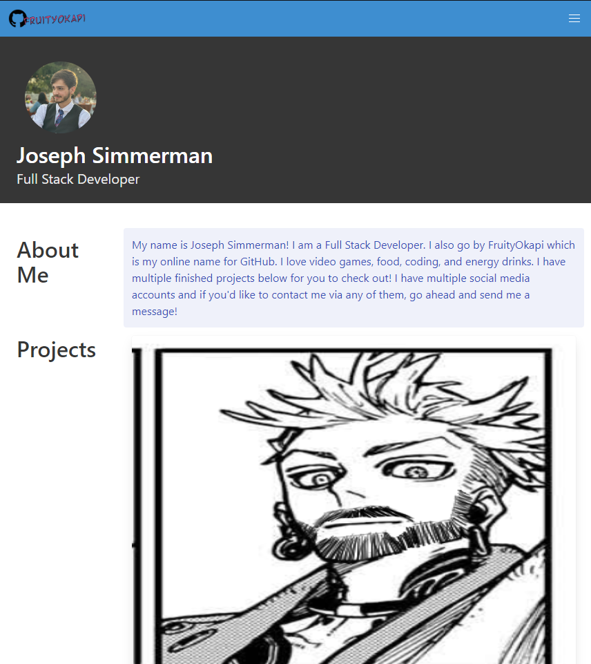
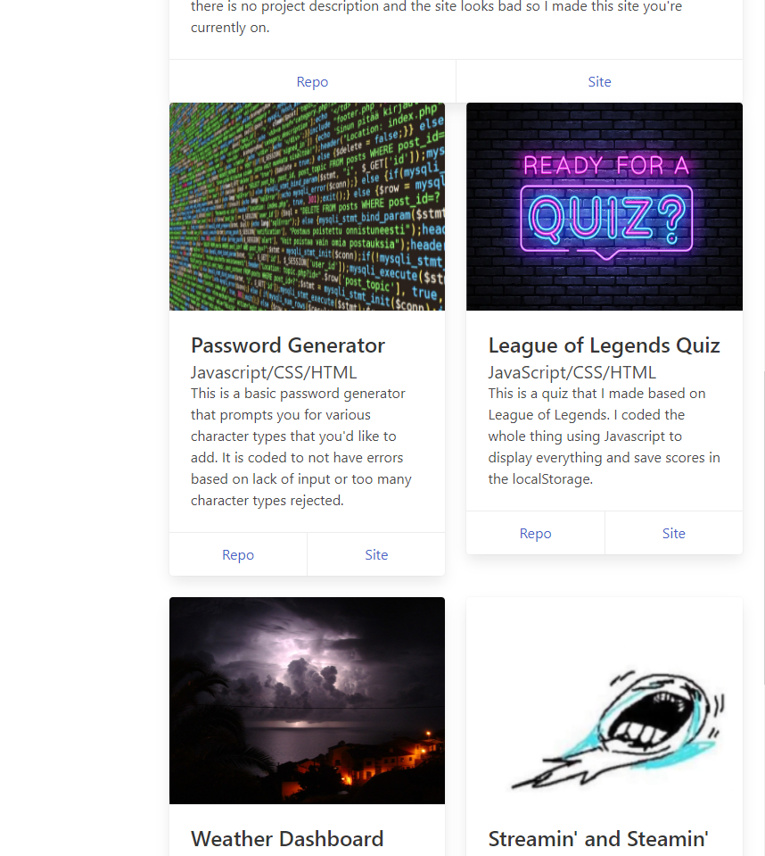
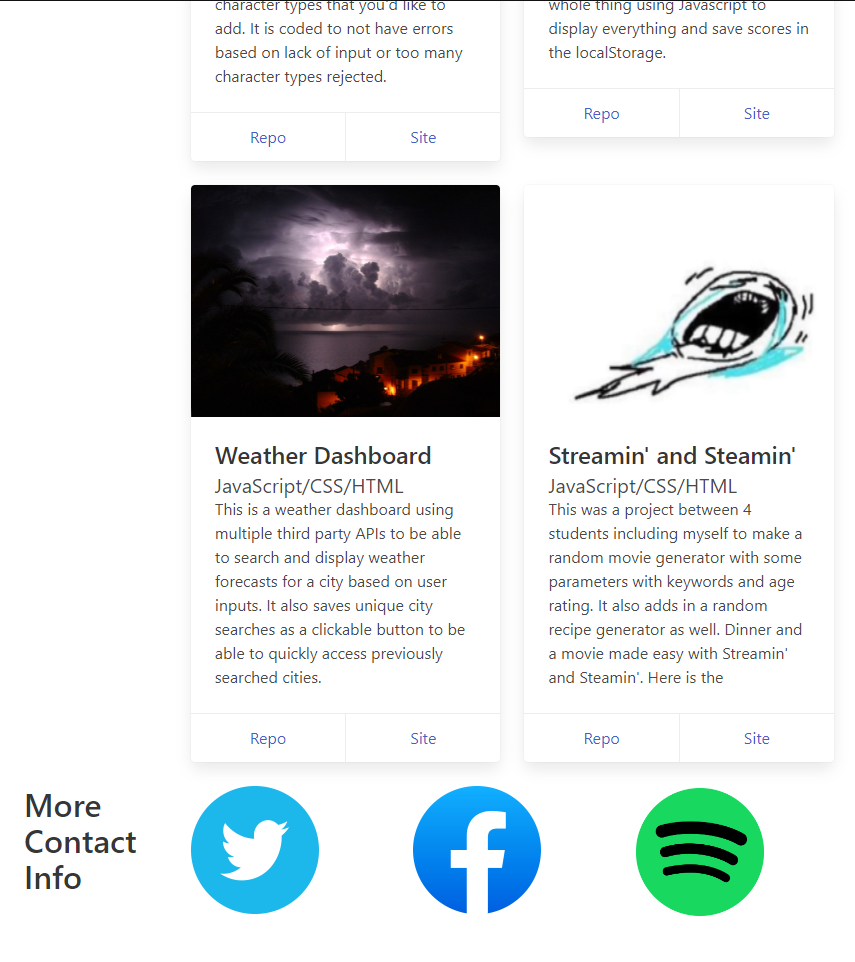

# Portfolio

## Description
This is my new and improved portfolio. With this version I made my projects have the image and a short description with the title, subtitle, and buttons that link to the repo and live site.

I learned a lot about Bulma 

## Installation
This is N/A as it is a webpage and can be run without installing.

## Usage
Use this site to find my contact info, projects, and information about myself. On mobile, the navbar menu turns into a hamburger menu. The dropdown of "On this page" will display the different sections. Clicking them will bring you to the section.

Here's a link to the site: https://fruityokapi.github.io/Portfolio/

## Credits
I used Bulma as the wireframe: https://bulma.io
I used jQuery for the hamburger menu: https://api.jquery.com

## License
The license is a default MIT license in the LICENSE.md file